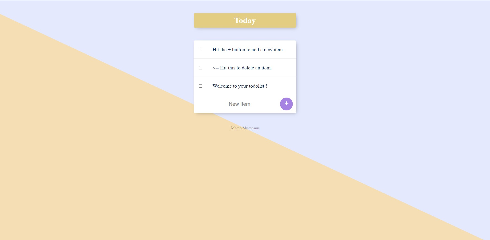
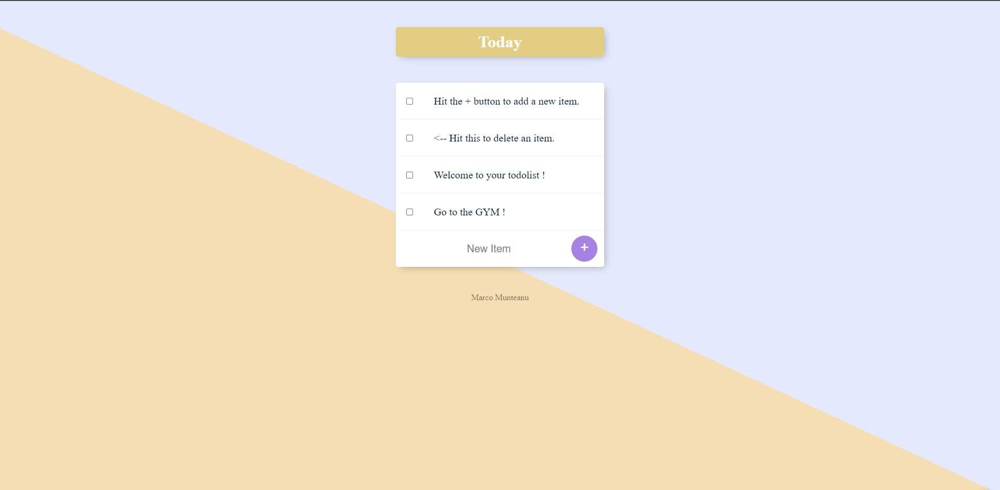
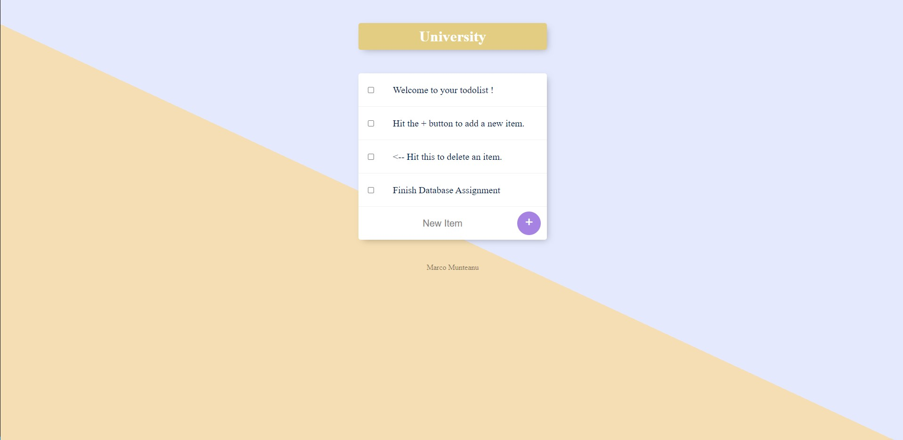

# ToDo App
A To Do App that lets the user have multiple lists for each subject. The user can create a new list by navigating to the url/ListName. 
The list are stored in a NoSQL database.
During this project I learend a lot about NodeJs, EJS and also MongoDB (alongisde Mongoose).
A few pictures :

Created a University List :

